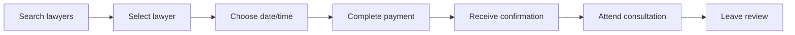
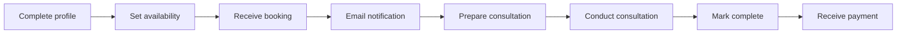

## Overview

This guide will walk you through the essential steps to start using upLegal, whether you're a client seeking legal services or a lawyer looking to expand your practice.

<CardGroup cols={2}>
  <Card title="I'm a client" icon="user" href="#for-clients">
    Find and book verified lawyers
  </Card>
  <Card title="I'm a lawyer" icon="scale-balanced" href="#for-lawyers">
    Join the platform and get clients
  </Card>
</CardGroup>

---

## For clients

Get legal help in 4 simple steps.

<Steps>
  <Step title="Create your account">
    
    Navigate to [upLegal](https://uplegal.netlify.app) and click the login/signup button in the header.
    
    <Tabs>
      <Tab title="Basic signup">
        1. Select **"Soy Cliente - Busco servicios legales"**
        2. Enter your first name and last name
        3. Provide a valid email address
        4. Create a strong password (8-18 characters, uppercase, lowercase, number, symbol)
        5. Confirm your password
        6. Click **"Crear cuenta"**
      </Tab>
      <Tab title="Email verification">
        After signup:
        
        1. Check your email inbox
        2. Find the verification email from upLegal
        3. Click the verification link
        4. Your account is now active!
        
        <Note>
        If you don't see the email, check your spam folder or click "Reenviar correo de confirmación"
        </Note>
      </Tab>
    </Tabs>

  </Step>

  <Step title="Search for lawyers">
    
    Use our powerful search to find the right lawyer:
    
    ### Search methods
    
    **By specialty**
    - Browse 19+ legal specialties including:
      - Derecho de Familia (family law)
      - Derecho Laboral (labor law)
      - Derecho Civil (civil law)
      - Derecho Penal (criminal law)
      - Derecho Inmobiliario (real estate law)
    
    **By location**
    - Filter by city or region across Chile
    - Find lawyers in your area or available for remote consultations
    
    **By price and rating**
    - Set your budget with price range filters
    - Filter by minimum rating (1-5 stars)
    - View hourly rates in CLP
    
    ### Lawyer profiles include
    
    <CardGroup cols={2}>
      <Card title="Verification badge" icon="shield-check">
        PJUD-verified lawyers display a "Verificado PJUD" badge
      </Card>
      <Card title="Experience" icon="briefcase">
        Years of practice and case history
      </Card>
      <Card title="Reviews" icon="star">
        Client ratings and detailed feedback
      </Card>
      <Card title="Specialties" icon="tags">
        All practice areas and expertise
      </Card>
    </CardGroup>
    
    <Tip>
    Click on a lawyer's card to view their full profile with bio, education, and client testimonials.
    </Tip>

  </Step>

  <Step title="Book a consultation">
    
    Once you've found the right lawyer:
    
    ### Select consultation details
    
    1. **Choose consultation method**
       - 📹 Videollamada (video call) - default option
       - 📞 Llamada (phone call)
    
    2. **Pick your date**
       - View available dates up to 30 days ahead
       - Sundays and Chilean holidays are automatically excluded
       - Dates are color-coded based on availability
    
    3. **Select time slot**
       - Available hours: 9:00 AM - 6:00 PM (weekdays)
       - Saturday hours: 9:00 AM - 2:00 PM
       - Time slots integrate with lawyer's Google Calendar
       - Unavailable slots are grayed out
    
    4. **Choose duration**
       - 30 minutes - half the hourly rate
       - 60 minutes - standard hourly rate
       - 90 minutes - 1.5x hourly rate
       - 120 minutes - 2x hourly rate
    
    ### Pricing breakdown
    
    ```
    Lawyer fee:         $XX,XXX CLP
    Service fee (10%):  +$X,XXX CLP
    ────────────────────────────
    Total to pay:       $XX,XXX CLP
    ```
    
    <Info>
    The 10% service fee covers platform maintenance, payment processing, and customer support.
    </Info>
    
    ### Complete booking
    
    After selecting all details:
    
    1. Review the booking summary
    2. Click **"Continuar al pago"**
    3. You'll be redirected to MercadoPago checkout
    
  </Step>

  <Step title="Complete payment and attend consultation">
    
    ### Payment process
    
    MercadoPago supports:
    - Credit/debit cards
    - Bank transfers
    - Other local payment methods
    
    After successful payment:
    
    1. ✅ Instant booking confirmation email sent to you
    2. ✅ Lawyer receives notification of new booking
    3. ✅ Appointment appears in your dashboard
    4. ✅ Calendar invite sent (if video call selected)
    
    ### Before the consultation
    
    <Tabs>
      <Tab title="Video call">
        - Check your email for the Google Meet link
        - Test your camera and microphone
        - Prepare any documents or questions
        - Join 2-3 minutes early
      </Tab>
      <Tab title="Phone call">
        - Ensure your phone number is correct in your profile
        - Be available at the scheduled time
        - The lawyer will call you
        - Have a pen and paper ready for notes
      </Tab>
    </Tabs>
    
    ### After the consultation
    
    1. Access your dashboard at `/dashboard`
    2. Navigate to "Consultations" tab
    3. Leave a review and rating
    4. Download consultation summary (if provided)
    
    <Tip>
    Reviews help other clients make informed decisions and help lawyers improve their services.
    </Tip>

  </Step>
</Steps>

---

## For lawyers

Start receiving clients through upLegal.

<Steps>
  <Step title="Sign up and verify">
    
    ### Create lawyer account
    
    1. Go to [upLegal signup](https://uplegal.netlify.app)
    2. Click login/signup button
    3. Select **"Soy Abogado - Ofrezco servicios legales"**
    
    ### RUT verification process
    
    <Warning>
    RUT verification is mandatory for all lawyers. Your profile will not be visible to clients until verified.
    </Warning>
    
    1. **Enter your RUT** in format XX.XXX.XXX-X
    2. **Enter your full legal name** (must match PJUD records)
    3. Click **"Verificar RUT"**
    4. System validates your RUT with Poder Judicial de Chile
    5. Upon success, you'll see: ✅ **"Verificado como abogado en el registro del Poder Judicial"**
    
    <Info>
    The RUT verification uses the official PJUD API to confirm you're a registered lawyer in Chile.
    </Info>
    
    ### Complete signup
    
    After RUT verification:
    
    ```typescript
    // Example signup data structure
    {
      rut: "12.345.678-9",
      firstName: "Juan",
      lastName: "Pérez",
      email: "juan.perez@example.com",
      password: "SecurePass123!",
      role: "lawyer",
      pjudVerified: true
    }
    ```
    
    1. Provide valid email address
    2. Create strong password
    3. Confirm password
    4. Click **"Crear cuenta"**
    5. Verify email address from inbox

  </Step>

  <Step title="Complete your profile">
    
    After verification, you'll be redirected to **Profile Setup** (`/dashboard/profile/setup`).
    
    ### Profile completion checklist
    
    Your profile completion is tracked as a percentage:
    
    <AccordionGroup>
      <Accordion title="Basic information (30%)" icon="user">
        - Professional photo (avatar)
        - Bio (200-500 words recommended)
        - Years of experience
        - Law firm name (optional)
        - Professional title
      </Accordion>
      
      <Accordion title="Specialties (20%)" icon="tags">
        Select your practice areas:
        - Primary specialty (required)
        - Additional specialties (up to 5)
        - Certifications in each area
      </Accordion>
      
      <Accordion title="Location & contact (15%)" icon="map-pin">
        - City/region
        - Office address (optional)
        - Professional email
        - Phone number
        - Website (optional)
      </Accordion>
      
      <Accordion title="Pricing (15%)" icon="dollar-sign">
        - Set hourly rate in CLP
        - Define consultation types offered
        - Specify payment terms
        
        <Tip>
        Research competitor rates in your specialty to price competitively.
        </Tip>
      </Accordion>
      
      <Accordion title="Education & credentials (20%)" icon="graduation-cap">
        - Law school and graduation year
        - Additional degrees or certifications
        - Professional memberships
        - Notable cases or achievements
      </Accordion>
    </AccordionGroup>
    
    ### Profile visibility
    
    ```
    Profile Completion: 0-30%   → Not visible to clients ❌
    Profile Completion: 30-70%  → Limited visibility ⚠️
    Profile Completion: 70-90%  → Good visibility ✓
    Profile Completion: 90-100% → Maximum visibility ✓✓
    ```

  </Step>

  <Step title="Set your availability">
    
    Navigate to `/lawyer/profile` and configure your schedule.
    
    ### Availability configuration
    
    The availability system uses a weekly grid:
    
    **Hours**: 9:00 AM - 7:00 PM (configurable per day)
    **Days**: Monday - Sunday
    
    <Tabs>
      <Tab title="Web interface">
        1. Click on time slots to toggle availability
        2. Green = available, Gray = unavailable
        3. Set different schedules for each day
        4. Saturday hours typically end at 2:00 PM
        5. Sundays are disabled by default
        
        Example weekly schedule:
        ```
        Monday:    9:00 AM - 6:00 PM
        Tuesday:   9:00 AM - 6:00 PM
        Wednesday: 9:00 AM - 6:00 PM
        Thursday:  9:00 AM - 6:00 PM
        Friday:    9:00 AM - 6:00 PM
        Saturday:  9:00 AM - 2:00 PM
        Sunday:    Closed
        ```
      </Tab>
      
      <Tab title="Data structure">
        Availability is stored as JSON:
        
        ```json
        {
          "Lunes": [true, true, true, true, true, true, true, true, true, false],
          "Martes": [true, true, true, true, true, true, true, true, true, false],
          "Miércoles": [true, true, true, true, true, true, true, true, true, false],
          "Jueves": [true, true, true, true, true, true, true, true, true, false],
          "Viernes": [true, true, true, true, true, true, true, true, true, false],
          "Sábado": [true, true, true, true, true, false, false, false, false, false],
          "Domingo": [false, false, false, false, false, false, false, false, false, false]
        }
        ```
        
        Each boolean represents an hour slot starting from 9:00 AM.
      </Tab>
    </Tabs>
    
    ### Google Calendar integration
    
    <Info>
    upLegal integrates with Google Calendar to prevent double bookings.
    </Info>
    
    When a client books:
    1. System checks your availability grid
    2. Validates against existing bookings in database
    3. Cross-references with Google Calendar busy times
    4. Only shows truly available slots to clients
    
    <Note>
    Connect your Google Calendar in Settings to enable automatic calendar blocking.
    </Note>

  </Step>

  <Step title="Start receiving bookings">
    
    Once your profile is complete and availability is set:
    
    ### Dashboard overview
    
    Access your lawyer dashboard at `/lawyer/dashboard`:
    
    <CardGroup cols={2}>
      <Card title="Appointments" icon="calendar" href="/lawyers/managing-appointments">
        View upcoming consultations, past appointments, and client details
      </Card>
      <Card title="Earnings" icon="dollar-sign" href="/lawyers/earnings-payouts">
        Track your revenue, payment history, and analytics
      </Card>
      <Card title="Profile" icon="user" href="/lawyers/profile-setup">
        Update your information, specialties, and rates
      </Card>
      <Card title="Services" icon="briefcase" href="/lawyers/managing-appointments">
        Manage your service offerings and consultation types
      </Card>
    </CardGroup>
    
    ### When you receive a booking
    
    1. **Email notification** with client details and appointment time
    2. **Dashboard alert** in the appointments section
    3. **Calendar event** automatically created
    4. **Client information** accessible in appointment details
    
    ### Before the consultation
    
    <Tabs>
      <Tab title="Preparation">
        - Review client's consultation type and notes
        - Prepare relevant documents or resources
        - Test video call link (Google Meet)
        - Have billing information ready
      </Tab>
      
      <Tab title="Video call setup">
        upLegal automatically generates Google Meet links:
        
        ```typescript
        // Google Meet link format
        meeting_link: "https://meet.google.com/xxx-xxxx-xxx"
        ```
        
        - Link is sent to both you and the client
        - Accessible from appointment details
        - Valid for the scheduled time + 30 minutes
      </Tab>
      
      <Tab title="Phone call">
        For phone consultations:
        
        - Client's phone number is in appointment details
        - You initiate the call at scheduled time
        - Call duration is tracked for billing
      </Tab>
    </Tabs>
    
    ### After the consultation
    
    1. Mark appointment as completed in dashboard
    2. Add consultation notes (private)
    3. Upload any documents or summaries for client
    4. Earnings are automatically calculated and displayed
    
    ### Payment structure
    
    ```
    Client pays (100%):       $110,000 CLP
      ├─ Platform fee (10%):  -$10,000 CLP
      └─ Your earnings (90%):  $100,000 CLP
    ```
    
    <Info>
    Payments are processed through MercadoPago and transferred to your account based on your payout schedule.
    </Info>

  </Step>
</Steps>

---

## Common workflows

### Client: Booking a consultation



### Lawyer: Receiving a client



---

## Best practices

<AccordionGroup>
  <Accordion title="For clients" icon="user">
    - Complete your profile with accurate contact information
    - Read lawyer reviews and compare multiple profiles
    - Prepare questions before your consultation
    - Test video call tech 10 minutes before appointment
    - Leave honest reviews to help the community
  </Accordion>
  
  <Accordion title="For lawyers" icon="scale-balanced">
    - Maintain 100% profile completion for maximum visibility
    - Update availability weekly to reflect your schedule
    - Respond to booking notifications within 24 hours
    - Provide detailed consultation summaries to clients
    - Keep your rates competitive within your specialty
  </Accordion>
</AccordionGroup>

---

## Troubleshooting

<AccordionGroup>
  <Accordion title="Can't verify email" icon="envelope">
    1. Check spam/junk folder
    2. Click "Reenviar correo de confirmación"
    3. Wait 5 minutes and check again
    4. Contact support if issue persists
  </Accordion>
  
  <Accordion title="RUT verification fails (lawyers)" icon="shield-xmark">
    Common issues:
    - Name doesn't match PJUD records exactly
    - RUT format incorrect (use XX.XXX.XXX-X)
    - Not registered with PJUD
    - Connection timeout - try again
    
    <Warning>
    Your name must match your official PJUD registration exactly, including accents and capitalization.
    </Warning>
  </Accordion>
  
  <Accordion title="No available time slots" icon="calendar-xmark">
    This happens when:
    - Lawyer hasn't set availability for selected date
    - All slots are booked
    - You're trying to book same-day (minimum 15 min advance required)
    - Selected day is Sunday or Chilean holiday
    
    Try selecting a different date or lawyer.
  </Accordion>
  
  <Accordion title="Payment declined" icon="credit-card">
    If MercadoPago declines payment:
    1. Verify card details are correct
    2. Ensure sufficient funds
    3. Try alternative payment method
    4. Contact your bank if issue persists
    5. The booking slot will be released automatically
  </Accordion>
</AccordionGroup>

---

## Next steps

<CardGroup cols={3}>
  <Card title="Browse lawyers" icon="search" href="https://uplegal.netlify.app/search">
    Start searching for legal services
  </Card>
  <Card title="Platform overview" icon="home" href="/introduction">
    Learn more about upLegal features
  </Card>
  <Card title="Development" icon="code" href="/technical/local-setup">
    Technical documentation
  </Card>
</CardGroup>