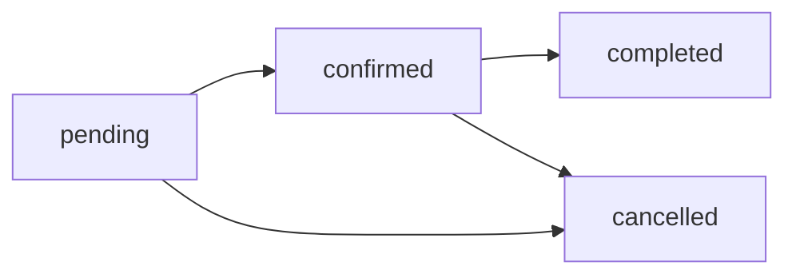

## Overview

The appointments system allows lawyers to view, manage, and conduct client consultations. All appointments are accessible through `/lawyer/citas` and managed via the `CitasPage` component.

## Appointment Dashboard

The appointments page provides a calendar-based interface with:

- **Weekly calendar view** with day navigation
- **Daily appointment list** for selected date
- **Search functionality** to filter appointments
- **Quick actions** for viewing, editing, and canceling

```typescript
// Main state management
const [selectedDate, setSelectedDate] = useState(new Date())
const [appointments, setAppointments] = useState<Appointment[]>([])
const [searchQuery, setSearchQuery] = useState('')
```

## Appointment Data Structure

```typescript
interface Appointment {
  id: string
  clientName: string
  clientEmail: string
  clientPhone: string
  service: string              // e.g., "Consulta Legal", "Asesoría"
  date: Date                   // Scheduled date/time
  duration: number             // In minutes (30, 60, 90, 120)
  status: 'pending' | 'confirmed' | 'completed' | 'cancelled'
  type: 'video' | 'phone' | 'in-person'
  notes?: string              // Additional context from client
}
```

## Viewing Appointments

### Calendar Navigation

<Steps>
  <Step title="Select Date">
    Use the calendar widget to select a specific day:
    
    ```typescript
    const goToToday = () => setSelectedDate(new Date())
    const goToPreviousDay = () => setSelectedDate(prev => addDays(prev, -1))
    const goToNextDay = () => setSelectedDate(prev => addDays(prev, 1))
    ```
    
    - Click on any day in the weekly view
    - Use arrow buttons to navigate previous/next day
    - Click "Hoy" button to jump to today
  </Step>

  <Step title="View Appointments for Date">
    Appointments are filtered by selected date:
    
    ```typescript
    const getAppointmentsForDate = (date: Date) => {
      const targetDate = new Date(date)
      targetDate.setHours(0, 0, 0, 0)
      const nextDay = new Date(targetDate)
      nextDay.setDate(targetDate.getDate() + 1)
      
      return appointments.filter(appt => {
        const apptDate = new Date(appt.date)
        return apptDate >= targetDate && apptDate < nextDay
      })
    }
    ```
  </Step>

  <Step title="Search Appointments">
    Filter appointments by client name or service:
    
    ```typescript
    const filteredAppointments = searchQuery
      ? dailyAppointments.filter(appt =>
          appt.clientName.toLowerCase().includes(searchQuery.toLowerCase()) ||
          appt.service.toLowerCase().includes(searchQuery.toLowerCase())
        )
      : dailyAppointments
    ```
  </Step>
</Steps>

### Appointment Card Display

Each appointment shows:

```typescript
<Card>
  <CardHeader>
    {/* Client Avatar */}
    <Avatar>
      <AvatarFallback>
        {appointment.clientName
          .split(' ')
          .map(n => n[0])
          .join('')
          .toUpperCase()}
      </AvatarFallback>
    </Avatar>
    
    {/* Client Name & Service */}
    <div className="font-semibold">{appointment.clientName}</div>
    <div className="text-sm text-muted-foreground">{appointment.service}</div>
    
    {/* Time & Duration */}
    <div className="flex items-center text-muted-foreground">
      <Clock className="mr-2 h-4 w-4" />
      {format(appointment.date, 'HH:mm')} - 
      {format(new Date(appointment.date.getTime() + appointment.duration * 60000), 'HH:mm')}
    </div>
    
    {/* Meeting Type Icon */}
    {appointment.type === 'video' ? <Video /> : 
     appointment.type === 'phone' ? <Phone /> : 
     <MapPin />}
  </CardHeader>
</Card>
```

## Creating Appointments

Lawyers can manually create appointments for clients:

<Steps>
  <Step title="Open Appointment Form">
    The `AppointmentForm` component handles creation:
    
    ```typescript
    <Dialog open={showNewAppointmentForm}>
      <DialogContent>
        <AppointmentForm
          initialData={{
            clientName: '',
            clientEmail: '',
            clientPhone: '',
            service: '',
            date: format(selectedDate, 'yyyy-MM-dd'),
            time: '10:00',
            duration: '30',
            type: 'video',
            notes: ''
          }}
          onSubmit={handleNewAppointment}
        />
      </DialogContent>
    </Dialog>
    ```
  </Step>

  <Step title="Fill Client Details">
    Enter client information:
    - Full name
    - Email address
    - Phone number (Chilean format)
  </Step>

  <Step title="Configure Appointment">
    Set appointment parameters:
    - Service type (from your active services)
    - Date and time
    - Duration (30/60/90/120 minutes)
    - Meeting type (video/phone/in-person)
    - Optional notes
  </Step>

  <Step title="Submit & Create">
    ```typescript
    const handleNewAppointment = async (data) => {
      // Find or create client profile
      const { data: existingClient } = await supabase
        .from('profiles')
        .select('id')
        .eq('email', data.clientEmail)
        .single()
      
      let clientId = existingClient?.id
      
      if (!clientId) {
        // Create new client
        const { data: newClient } = await supabase
          .from('profiles')
          .insert({
            first_name: data.clientName.split(' ')[0],
            last_name: data.clientName.split(' ').slice(1).join(' '),
            email: data.clientEmail,
            phone: data.clientPhone,
            role: 'client'
          })
          .select('id')
          .single()
        
        clientId = newClient.id
      }
      
      // Create appointment
      await supabase
        .from('appointments')
        .insert({
          client_id: clientId,
          lawyer_id: session.user.id,
          date: new Date(`${data.date}T${data.time}`).toISOString(),
          duration: parseInt(data.duration, 10),
          status: 'pending',
          type: data.type,
          service_type: data.service,
          notes: data.notes
        })
    }
    ```
  </Step>
</Steps>

## Appointment Actions

### View Details

Click **Ver** to open full appointment details:

```typescript
const handleViewAppointment = (appointment: Appointment) => {
  setViewingAppointment(appointment)
}

<Dialog open={!!viewingAppointment}>
  <DialogContent>
    <DialogHeader>
      <DialogTitle>Detalles de la Cita</DialogTitle>
    </DialogHeader>
    
    <div className="space-y-4">
      <div>
        <h4 className="font-medium">Cliente</h4>
        <p>{viewingAppointment?.clientName}</p>
      </div>
      <div>
        <h4 className="font-medium">Servicio</h4>
        <p>{viewingAppointment?.service}</p>
      </div>
      <div>
        <h4 className="font-medium">Fecha y Hora</h4>
        <p>{format(viewingAppointment.date, 'PPP p', { locale: es })}</p>
      </div>
      {viewingAppointment?.notes && (
        <div>
          <h4 className="font-medium">Notas</h4>
          <p className="whitespace-pre-line">{viewingAppointment.notes}</p>
        </div>
      )}
    </div>
  </DialogContent>
</Dialog>
```

### Edit Appointment

Click **Editar** to modify appointment details:

```typescript
const handleEditAppointment = (appointment: Appointment) => {
  setEditingAppointment(appointment)
  setShowNewAppointmentForm(true)
}

// Form pre-populated with existing data
<AppointmentForm
  initialData={{
    ...editingAppointment,
    date: format(editingAppointment.date, 'yyyy-MM-dd'),
    time: format(editingAppointment.date, 'HH:mm'),
    duration: editingAppointment.duration.toString()
  }}
  isEditing={true}
/>
```

### Cancel Appointment

Click **Cancelar** to cancel with confirmation:

```typescript
const confirmDeleteAppointment = async () => {
  if (!appointmentToDelete) return
  
  try {
    // Update appointment status to cancelled
    await supabase
      .from('appointments')
      .update({ status: 'cancelled' })
      .eq('id', appointmentToDelete)
    
    // Remove from local state
    setAppointments(appointments.filter(appt => 
      appt.id !== appointmentToDelete
    ))
    
    toast({
      title: 'Cita cancelada',
      description: 'La cita ha sido cancelada correctamente.'
    })
  } catch (error) {
    toast({
      title: 'Error',
      description: 'No se pudo cancelar la cita.',
      variant: 'destructive'
    })
  }
}

// Confirmation dialog
<Dialog open={!!appointmentToDelete}>
  <DialogContent>
    <DialogHeader>
      <DialogTitle>¿Cancelar cita?</DialogTitle>
      <DialogDescription>
        ¿Estás seguro de que deseas cancelar esta cita? 
        Esta acción no se puede deshacer.
      </DialogDescription>
    </DialogHeader>
    <DialogFooter>
      <Button variant="outline" onClick={() => setAppointmentToDelete(null)}>
        Volver
      </Button>
      <Button variant="destructive" onClick={confirmDeleteAppointment}>
        Sí, cancelar cita
      </Button>
    </DialogFooter>
  </DialogContent>
</Dialog>
```

<Warning>
  Canceling an appointment sends a notification to the client and may trigger automatic refunds if payment was processed.
</Warning>

## Appointment Status Flow



| Status | Description | Actions Available |
|--------|-------------|-------------------|
| **pending** | Client booked, awaiting lawyer confirmation | Confirm, Edit, Cancel |
| **confirmed** | Lawyer accepted, scheduled | Edit, Cancel, Complete |
| **completed** | Consultation finished | View, Review |
| **cancelled** | Appointment cancelled | View only |

## Meeting Types

### Video Consultation

```typescript
type: 'video'
```

- Conducted via Zoom (lawyer's `zoom_link` from profile)
- Link sent to client upon confirmation
- Duration: typically 30-60 minutes

<Info>
  Lawyers can set their Zoom link in profile settings under `zoom_link` field.
</Info>

### Phone Consultation

```typescript
type: 'phone'
```

- Lawyer calls client at scheduled time
- Client's phone number shown in appointment details
- Duration: typically 15-30 minutes

### In-Person Meeting

```typescript
type: 'in-person'
```

- Client visits lawyer's office
- Location from lawyer's `location` field
- Duration: typically 60+ minutes

## Fetching Appointments from Database

```typescript
const fetchAppointments = async () => {
  const { data: { session } } = await supabase.auth.getSession()
  if (!session) return
  
  const { data: appointments, error } = await supabase
    .from('appointments')
    .select(`
      id,
      date,
      duration,
      status,
      type,
      notes,
      service_type,
      client:profiles!appointments_client_id_fkey (
        id,
        first_name,
        last_name,
        email,
        phone
      )
    `)
    .eq('lawyer_id', session.user.id)
    .order('date', { ascending: true })
  
  // Transform to expected format
  const formatted = appointments.map(appt => ({
    id: appt.id,
    clientName: `${appt.client?.first_name} ${appt.client?.last_name}`.trim(),
    clientEmail: appt.client?.email || '',
    clientPhone: appt.client?.phone || '',
    service: appt.service_type || 'Consulta',
    date: new Date(appt.date),
    duration: appt.duration || 30,
    status: appt.status || 'pending',
    type: appt.type || 'video',
    notes: appt.notes || ''
  }))
  
  setAppointments(formatted)
}
```

## Dashboard Integration

Appointments appear on the main dashboard:

```typescript
// From DashboardPage.tsx
const [counters, setCounters] = useState({
  todayAppointments: 0,
  // ...
})

// Fetch today's appointments count
const { count: appointmentsCount } = await supabase
  .from('appointments')
  .select('*', { count: 'exact', head: true })
  .eq('lawyer_id', user.id)
  .gte('scheduled_time', startOfDay.toISOString())
  .lt('scheduled_time', endOfDay.toISOString())
  .eq('status', 'confirmed')

setCounters({ todayAppointments: appointmentsCount || 0 })
```

<Card title="Today's Appointments" icon="calendar">
  Displays count of confirmed appointments for the current day with quick navigation to appointments page.
</Card>

## Activity Feed

Recent appointments appear in the dashboard activity feed:

```typescript
const { data: appointments } = await supabase
  .from('appointments')
  .select('id, scheduled_time, status, client:profiles!appointments_client_id_fkey(first_name, last_name)')
  .eq('lawyer_id', user.id)
  .order('scheduled_time', { ascending: false })
  .limit(5)

appointments?.forEach(appointment => {
  activities.push({
    id: `appt_${appointment.id}`,
    type: 'appointment',
    title: `Cita ${appointment.status === 'confirmed' ? 'confirmada' : 'pendiente'}`,
    description: `Con ${appointment.client?.first_name} para el ${format(parseISO(appointment.scheduled_time), "d 'de' MMMM 'a las' HH:mm", { locale: es })}`,
    createdAt: appointment.scheduled_time
  })
})
```

## Best Practices

<CardGroup cols={2}>
  <Card title="Confirm Promptly" icon="check">
    Review and confirm pending appointments within 24 hours to improve client satisfaction.
  </Card>
  
  <Card title="Add Notes" icon="note">
    Use the notes field to record consultation context and follow-up actions.
  </Card>
  
  <Card title="Update Status" icon="refresh">
    Mark appointments as completed after consultations to maintain accurate records.
  </Card>
  
  <Card title="Respect Time" icon="clock">
    Start consultations on time and stay within the scheduled duration.
  </Card>
</CardGroup>